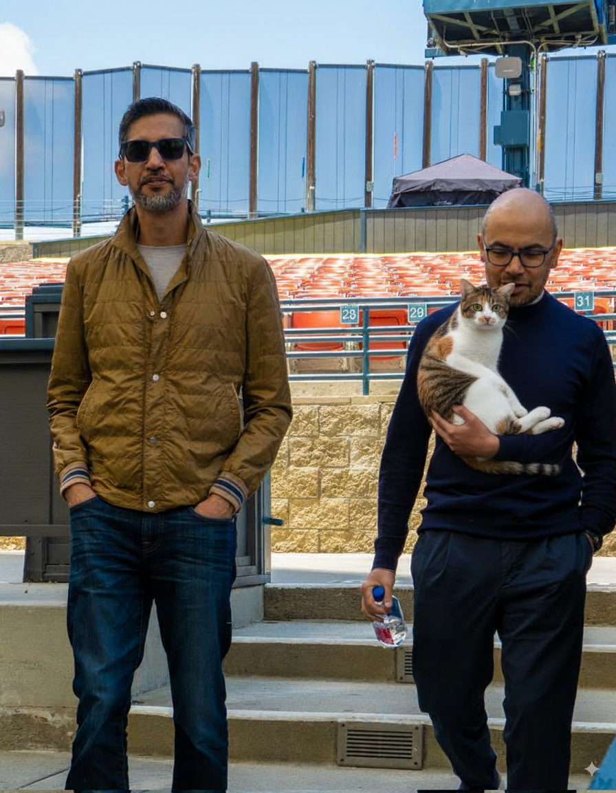

# nano banana & veo3 활용 과제

## input
- 고양이 (제가 키우는) 의 다양한 구도 사진을 준비했습니다.

- 순다르 피차이와 데미스 하사비스가 같이 있는 사진을 준비했습니다. (순다르 피차이가 X 에 트윗한 이미지)

## output

### trial 1

**prompt:**
> 첨부한 첫번째 ~ 네번째 사진의 고양이는 동일 고양이의 다양한 구도 사진이야
> 이 고양이가 다섯번째 사진의 두 사람 중 오른쪽 사람이 이 고양이를 안고 있도록 이미지를 편집해줘

**output:**

### trial 2

**prompt:**

>이 사진에서는 내가 보는 방향 기준으로 오른쪽 사람의 팔이 주머니에 들어간 팔, 고양이를 안고있는 팔, 물병을 든 팔 이렇게 3개야
>이건 논리적인 오류가 있어 확실하게 수정해줘

**output:**

### trial 3

**prompt:**
>그리고 두 사람 다 고양이쪽 방향을 보면서 흐뭇해하는 표정을 보였으면 좋겠어

**output:**

### VEO3

**prompt:**

>왼쪽 사람이 주머니에서 손을 꺼내서 고양이를 쓰다듬고 고양이는 좋아하는 영상을 만들어줘

**output:**

클릭하시면 유튜브로 이동됩니다!

